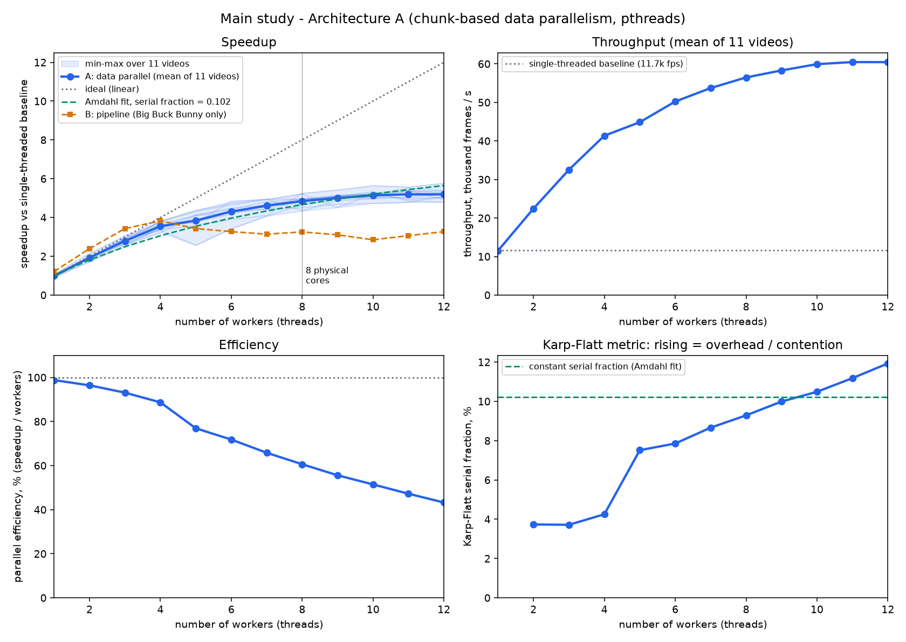

# Multi-Threaded Video Segmentation

Temporal video segmentation in C with POSIX threads: **shot boundary detection** (camera cuts) and **scene segmentation** (grouping shots into scenes), with a study of how well each stage parallelises.

The main design is **chunk-based data parallelism**: the video is split into contiguous chunks, worker threads claim chunks through a mutex-protected counter, and each worker writes only its own slice of the result. A pipeline (task-parallel) variant is included as a short comparison.

Full write-up with all numbers, figures and code excerpts: [`docs/Report_MultiThreaded_Video_Segmentation.docx`](docs/Report_MultiThreaded_Video_Segmentation.docx).

## Results

Measured on an Intel i5-12450HX (8 cores / 12 threads), Windows 11, GCC 16.2 `-O2`; 11 real videos, median of 5 runs.

| Workers | Frames/s | Speedup | Efficiency |
|---|---|---|---|
| 1 | 11,513 | 0.99x | 99% |
| 4 | 41,358 | 3.55x | 89% |
| 8 | 56,483 | 4.85x | 61% |
| 12 | 60,451 | **5.19x** | 43% |



- Output is **bit-identical** at every worker count and chunk size (`tests/`).
- Speedup is near-linear to 4 workers, then limited by growing overhead and contention (rising Karp-Flatt metric), not by serial code.
- The task-parallel pipeline peaks at 3.8x and then declines.
- **Shot (cut) detection:** F1 0.91 against an independent detector on Big Buck Bunny. Hard cuts only; fades and dissolves are mostly missed.
- **Scene segmentation:** F1 about **0.35** at 2 s tolerance on 10 human-labelled videos (95% interval 0.25-0.44, 116 true boundaries), with parameters chosen by leave-one-video-out so no video is scored with parameters tuned on it. The best trivial baseline (every detected cut = boundary) scores 0.17. Most of the improvement over an earlier 0.13 came from better tuning and evaluation, not from richer features; the gain from a spatial grid, edge-orientation and multi-keyframe descriptors over a tuned global histogram (+0.06) is within noise on this small test set. Details: [`results/scene_cv.md`](results/scene_cv.md) and the metric audit [`results/audit_metric.md`](results/audit_metric.md).
- A simple classical alternative (spectral clustering of the shot-similarity matrix, the baseline of Baraldi et al. 2015) scored lower under the same protocol (F1 0.31, M_iou 0.47 against 0.35 and 0.53), see [`results/scene_compare.md`](results/scene_compare.md). Audio and transcript cues, which that paper found useful, were not tried.
- The scene layer's dynamic-programming stages are sequential, capping that layer near 2.3x.

## Layout

| Path | Purpose |
|---|---|
| `c/arch_a.c` | Architecture A: data-parallel chunk workers (main design) |
| `c/arch_b.c` | Architecture B: reader / queue / workers / merger pipeline |
| `c/seq.c` | Single-threaded baseline |
| `c/common.[ch]`, `c/threshold.c` | Timing, HSV histogram, Bhattacharyya distance, adaptive threshold |
| `c/scenes.[ch]`, `c/scene_bench.c` | Scene layer and its synthetic benchmark |
| `c/features.[ch]`, `c/scene_api.c` | Keyframe descriptors (3x3 colour grid, edge orientation; parallel over shots); C entry point for Python |
| `tools/` | Data generation, evaluation, benchmarks, study and plotting scripts; `audit_metric.py` and `scene_cv.py` for the scene evaluation |
| `tests/` | Thread-count and chunk-size invariance tests |
| `results/` | Figures and tables behind the report |

## Build and run

Requires GCC with pthreads (MinGW-w64 on Windows, or any Linux/macOS gcc), Python 3 with `numpy` and `matplotlib`, and `ffmpeg` to prepare videos.

```bash
gcc -O2 -Wall -Wextra -pthread -o c/shotseg c/main.c c/common.c c/threshold.c \
    c/seq.c c/arch_a.c c/arch_b.c c/scenes.c c/scene_bench.c c/features.c -lm
```

Videos are decoded once to a headerless raw BGR file so any thread can seek straight to its chunk:

```bash
ffmpeg -i input.mp4 -vf scale=160:90 -pix_fmt bgr24 -f rawvideo data/video_160x90.raw
```

```bash
./c/shotseg data/video_160x90.raw 160 90 a 8     # Architecture A, 8 workers
#                                       modes: seq | a | b | scenes
```

Tests and the main study (script paths expect `c/shotseg.exe` on Windows; adjust `EXE` in the scripts on other systems):

```bash
python tools/gen_synth.py                        # synthetic video with exact ground truth
python -m unittest tests.test_invariance -v
python tools/study.py && python tools/plot_study.py
```

Scene evaluation (needs the RAI videos as raw files and a shared library for Python):

```bash
gcc -O2 -shared -static -pthread -o c/libscene.dll c/scene_api.c c/scenes.c c/features.c c/common.c -lm
python tools/audit_metric.py      # label/scorer audit, recall ceiling, baselines
python tools/scene_cv.py          # leave-one-video-out feature comparison
python tools/scene_compare.py     # DP vs spectral clustering, adds the M_iou metric
```

## Data

Videos are not included. Experiments used [Big Buck Bunny](https://peach.blender.org/) (Blender Foundation, CC-BY 3.0) and the RAI shot/scene dataset (Baraldi et al.), plus a generated synthetic video. Obtain these separately and respect their licences.

## Limitations

- Frames are pre-decoded, so codec decoding is not in the timings.
- One machine with a hybrid CPU and a warm file cache; run-to-run variation is about 15%.
- Classical colour-histogram methods only (no deep models).
- The scene layer is a simplified version of Liu et al. (2013): fixed block weights, parameters chosen by cross-validation, no learned features. The scene test set is small (116 boundaries), so differences of a few hundredths in F1 are not distinguishable.
